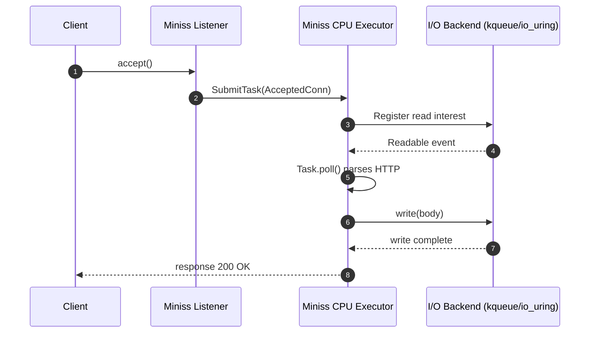
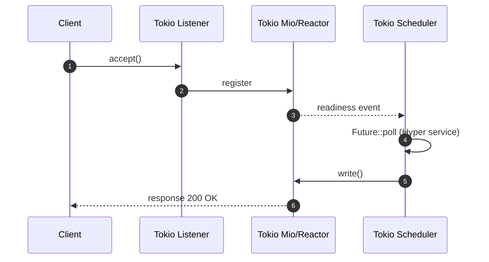

# Rust-Miniss Architecture

## Overview

Rust-Miniss implements a **shared-nothing architecture** inspired by [Seastar](https://seastar.io/), where each CPU core operates independently with its own event loop, memory pools, and task scheduler. This design eliminates contention and maximizes CPU cache efficiency.

## Core Principles

### 1. Shared-Nothing Design

- **Per-CPU Executors**: Each CPU core runs a dedicated thread with its own executor
- **No Shared State**: Each CPU maintains its own task queue, timer wheel, and I/O context
- **Lock-Free Communication**: Cross-CPU communication uses SPSC (Single Producer, Single Consumer) queues

### 2. Zero-Copy I/O

- **Direct Memory Access**: Uses io-uring on Linux for kernel-bypass I/O
- **Pre-allocated Buffers**: Buffer pools to minimize allocations during I/O operations
- **Batched Operations**: Grouping I/O operations for better throughput

### 3. Minimal Allocations

- **Memory Pools**: Pre-allocated data structures to avoid runtime allocations
- **RAII Management**: Automatic resource cleanup using Rust's ownership system
- **Configured Capacities**: Tunable memory pool sizes for different workloads

## System Architecture

```
┌─────────────────────────────────────────────────────────────────┐
│                    Multi-Core Runtime                           │
├─────────────┬─────────────┬─────────────┬─────────────────────┤
│   CPU 0     │   CPU 1     │   CPU 2     │   Signal Handler    │
│             │             │             │                     │
│ ┌─────────┐ │ ┌─────────┐ │ ┌─────────┐ │ ┌─────────────────┐ │
│ │Task     │ │ │Task     │ │ │Task     │ │ │OS Signal        │ │
│ │Queue    │ │ │Queue    │ │ │Queue    │ │ │Listener         │ │
│ └─────────┘ │ └─────────┘ │ └─────────┘ │ │(SIGINT/SIGTERM) │ │
│             │             │             │ └─────────────────┘ │
│ ┌─────────┐ │ ┌─────────┐ │ ┌─────────┐ │                     │
│ │Timer    │ │ │Timer    │ │ │Timer    │ │ ┌─────────────────┐ │
│ │Wheel    │ │ │Wheel    │ │ │Wheel    │ │ │Cross-CPU        │ │
│ └─────────┘ │ └─────────┘ │ └─────────┘ │ │Message Bus      │ │
│             │             │             │ └─────────────────┘ │
│ ┌─────────┐ │ ┌─────────┐ │ ┌─────────┐ │                     │
│ │I/O      │ │ │I/O      │ │ │I/O      │ │                     │
│ │Backend  │ │ │Backend  │ │ │Backend  │ │                     │
│ └─────────┘ │ └─────────┘ │ └─────────┘ │                     │
└─────────────┴─────────────┴─────────────┴─────────────────────┘
```

## Call Stack Comparison (Mermaid)

Rust-Miniss vs Tokio call stack for a simple HTTP echo request:





## Component Details

### CPU Executor

Each CPU executor (`src/cpu.rs`) maintains:

```rust
pub struct Cpu {
    id: usize,                              // CPU core ID
    task_queue: HashMap<TaskId, Task>,      // Local task storage
    ready_queue: Arc<SegQueue<TaskId>>,     // Lock-free ready queue
    message_receiver: Receiver<CrossCpuMessage>, // Cross-CPU communication
    timer: TimerWheel,                      // Local timer wheel
    io_backend: Arc<dyn IoBackend>,         // I/O operations
}
```

**Key Features:**
- **O(1) Task Scheduling**: Uses hash map for task storage with lock-free ready queue
- **CPU Affinity**: Pins threads to specific CPU cores for cache locality
- **Message Processing**: Handles cross-CPU task submission and cancellation
- **Timer Integration**: Local timer wheel for efficient timeout handling

### Timer Wheel

The timer wheel (`src/timer/mod.rs`) provides high-performance timeout scheduling:

```rust
pub struct TimerWheel {
    slots: Vec<VecDeque<Entry>>,    // Circular buffer of timer slots
    resolution_ms: u64,             // Time resolution in milliseconds
    num_slots: usize,               // Number of slots in the wheel
    current_slot: usize,            // Current position in the wheel
}
```

**Performance Characteristics:**
- **O(1) Insert**: Adding timers takes constant time
- **O(1) Cancel**: Removing timers by ID takes constant time (with search)
- **Batch Expiration**: Process multiple expired timers efficiently
- **Memory Efficient**: Pre-allocated slots minimize allocations

### Cross-CPU Communication

Tasks can be submitted to any CPU using lock-free SPSC channels:

```rust
pub enum CrossCpuMessage {
    SubmitTask {
        task_id: TaskId,
        task: Box<dyn Future<Output = ()> + Send>,
    },
    CancelTask(TaskId),
    Shutdown,
}
```

**Communication Flow:**
1. **Task Submission**: Runtime routes tasks to least-loaded CPU
2. **Message Queuing**: Uses bounded SPSC channels for back-pressure
3. **Local Processing**: Each CPU processes messages in its event loop
4. **Load Balancing**: Simple round-robin or load-based distribution

### I/O Backends

The runtime supports multiple I/O backends based on platform:

#### io-uring (Linux)
```rust
pub struct IoUringBackend {
    ring: IoUring,                          // io-uring instance
    submissions: Slab<IoCompletion>,        // Pending operations
}
```

#### epoll/kqueue (Fallback)
```rust
pub struct EpollBackend {
    epoll_fd: RawFd,                        // epoll file descriptor
    events: Vec<EpollEvent>,                // Event buffer
}
```

## Performance Design

### Memory Management

1. **Pre-allocated Pools**:
   ```rust
   // Configuration constants
   pub const INITIAL_TASK_QUEUE_CAPACITY: usize = 128;
   pub const EXPECTED_WAKEUP_COUNT: usize = 16;
   pub const CROSS_CPU_CHANNEL_CAPACITY: usize = 1000;
   ```

2. **Memory Pool Strategy**:
   - Task queues start with reasonable capacity
   - Timer wheel slots pre-allocate VecDeques
   - Cross-CPU channels use bounded queues for back-pressure

### CPU Cache Optimization

1. **Thread Pinning**: Each executor pins to a specific CPU core
2. **Local Data**: All frequently accessed data stays CPU-local
3. **NUMA Awareness**: Future support for NUMA topology

### Lock-Free Data Structures

1. **Ready Queue**: Uses `crossbeam::SegQueue` for lock-free task scheduling
2. **Cross-CPU Channels**: SPSC channels from `crossbeam-channel`
3. **Atomic Operations**: Minimal use for task ID generation and shutdown coordination

## Task Lifecycle

```
1. Task Creation
   ┌─────────────┐
   │User calls   │
   │spawn()      │
   └─────┬───────┘
         │
         ▼
2. CPU Selection
   ┌─────────────┐
   │Runtime      │
   │selects CPU  │
   └─────┬───────┘
         │
         ▼
3. Task Submission
   ┌─────────────┐
   │Send         │
   │CrossCpuMsg  │
   └─────┬───────┘
         │
         ▼
4. Local Processing
   ┌─────────────┐
   │CPU adds to  │
   │ready queue  │
   └─────┬───────┘
         │
         ▼
5. Execution
   ┌─────────────┐
   │Task.poll()  │
   │in event loop│
   └─────┬───────┘
         │
         ▼
6. Completion
   ┌─────────────┐
   │Task removed │
   │from queue   │
   └─────────────┘
```

## Error Handling Strategy

### Panic Safety
- **Catch Unwind**: Task panics are caught and converted to errors
- **Isolation**: Panics in one task don't affect others
- **Graceful Degradation**: System continues operating with fewer resources

### Resource Management
- **RAII**: Rust's ownership system ensures cleanup
- **Drop Implementations**: Custom Drop for proper resource release
- **Resource Limits**: Bounded channels and pools prevent resource exhaustion

### Error Propagation
```rust
pub enum RuntimeError {
    RuntimeShutdown,
    TaskSubmissionFailed(String),
    IoError(IoError),
}
```

## Signal Handling

The signal handler (`src/signal.rs`) coordinates graceful shutdown:

1. **Signal Detection**: Dedicated thread listens for OS signals
2. **Shutdown Coordination**: Sets atomic shutdown flag
3. **Graceful Termination**: Broadcasts shutdown messages to all CPUs
4. **Resource Cleanup**: Ensures all tasks complete or are cancelled

## Performance Targets

| Operation | Target Latency |
|-----------|----------------|
| Future creation/completion | < 50ns |
| Cross-CPU message | < 200ns |
| Task scheduling | < 100ns |
| Timer operations | < 100ns |
| File I/O setup | < 1μs |

## Scalability Characteristics

### CPU Scaling
- **Linear Scaling**: Performance scales linearly with CPU cores
- **No Contention**: Each CPU operates independently
- **Load Distribution**: Tasks distributed across available CPUs

### Memory Scaling
- **Bounded Growth**: Memory usage grows predictably with task count
- **Pool Reuse**: Memory pools reduce allocation overhead
- **Configurable Limits**: Tunable parameters for different workloads

### I/O Scaling
- **Batched Operations**: Group I/O for better throughput
- **Zero-Copy**: Minimize data copying in I/O paths
- **Backend Selection**: Choose optimal I/O backend per platform

## Future Enhancements

### NUMA Awareness
- **Topology Detection**: Detect NUMA topology at runtime
- **CPU Grouping**: Group CPUs by NUMA node
- **Memory Locality**: Prefer local memory allocation

### Advanced I/O
- **Buffer Pools**: Shared buffer pools for I/O operations
- **Direct I/O**: Bypass page cache for large files
- **Network Acceleration**: DPDK integration for high-speed networking

### Monitoring
- **Metrics Collection**: Runtime performance metrics
- **Task Profiling**: Track task execution patterns
- **Resource Monitoring**: CPU, memory, and I/O utilization

This architecture provides a foundation for high-performance async applications while maintaining the safety and ergonomics of Rust.
